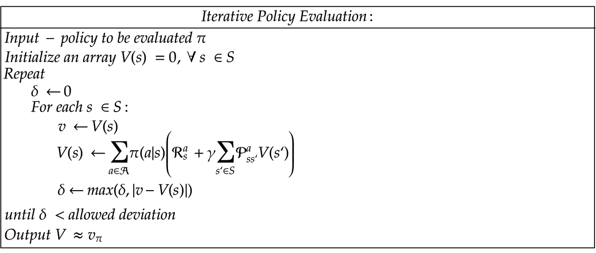

---
layout:       post
title:        策略评估
subtitle:     policy evaluation
date:         2020-02-13 21:53:00
author:       "xuepro"
header-img:   "img/home_bg.jpg"
header-mask:  0.3
catalog:      true
multilingual: true
tags:
    - RL    
---    

策略评估的伪代码如下：

Policy_Evaluation(输入：环境$p(s',r \lvert s,a )$，策略$\pi$)

+ 初始化所有状态的价值为0：$V(s), s\in S$
+ for $k = 0,1, $:
    - 初始化逼近误差 $\delta \leftarrow 0$
    - for 每个$s\in S$:
      - 保存$V_{k}(s)$：$v\leftarrow V(s)$
      - 根据策略$\pi(a\lvert s)$更新 $V_{k+1}(s)$: $V(s)\leftarrow \sum_\limits{a} \pi (a \lvert s) \sum_\limits{s',r}  p(s',r \lvert s,a ) [r+\gamma V(s')]$
      - 计算最大误差：$\delta \leftarrow max(\delta,|v- V(s)|)$
    - 如果 $\delta$足够小，则跳出for循环
    
+ 返回$V\sim V^{\pi}$




下面的函数value_by_bellman_equation根据贝尔曼方程通过迭代更新状态价值进行策略的评估，其中参数env、policy、gamma分别表示环境对象、策略和折扣因子。

```python
#用贝尔曼方程求策略policy的价值函数
def value_by_bellman_equation(env,policy,gamma = 1.0):
    ''' 求解贝尔曼(期望)方程
    '''
    # 初始价值函数
    value = np.zeros(env.nS)   
   
    while True:
        new_value = np.zeros(value.shape)
        # 遍历所有状态
        for s in range(0, env.nS):               
                # 遍历所有动作
                for a in range(0, env.nA):
                    # 对每个动作,遍历可能的转移状态和奖励
                    Gt = 0.
                    for t in env.P[s][a]:
                        prob,s_,reward,dead = t                        
                        Gt += prob*(reward + gamma * value[s_])                        
                    # 贝尔曼期望方程    
                    new_value[s] += policy[s][a] * Gt          
       
        # 迭代终止条件: 误差小于1e-4
        if np.sum(np.abs(value - new_value)) < 1e-8:            
            break
            
        value = new_value
    return value
```

策略可以是任何策略，如下面函数定义了一个等概率策略：

```python
#生成等概率动作的策略的函数对象
def make_equal_policy(nA):   
    action_probs={}
    prob = 1./nA 
    for s in range(0, env.nS):  
        action_probs[s] =  [prob for a in range(nA)] # {a : prob for a in range(nA)}
    return   action_probs       
```
辅助函数print_value用于打印状态价值：

```python
def print_value(value,shape=[3,4]):
    grid = np.arange(len(value)).reshape(shape)
    it = np.nditer(grid, flags=['multi_index'])

    while not it.finished:
            s = it.iterindex
            y, x = it.multi_index
            v = value[s]
            if v >= 0:
                print(" %.4f|" % v, end="")
            else:
                print("%.4f|" % v, end="") # -ve sign takes up an extra space
                
         
            if x == shape[1] - 1:
                print("")
            it.iternext()  
```
下面代码先用make_equal_policy定义了一个策略对象policy，然后调用策略函数函数value_by_bellman_equation评估该策略，最后用print_value函数输出这个策略对应的所有状态的价值：

```python

policy = make_equal_policy(env.nA)

value = value_by_bellman_equation(env,policy)
print_value(value)
```
输出：

     0.0035| 0.0910| 0.2012| 0.0000|
    -0.0840| 0.0000|-0.4184| 0.0000|
    -0.1925|-0.3011|-0.4848|-0.7424|
