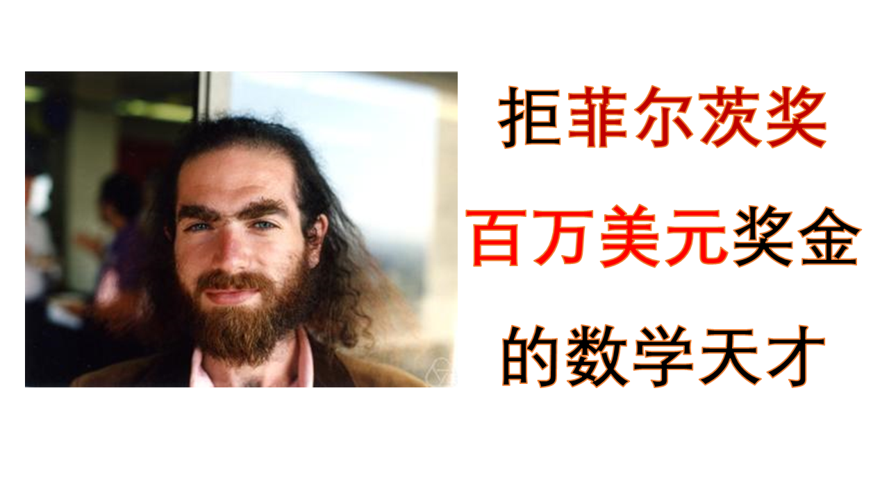
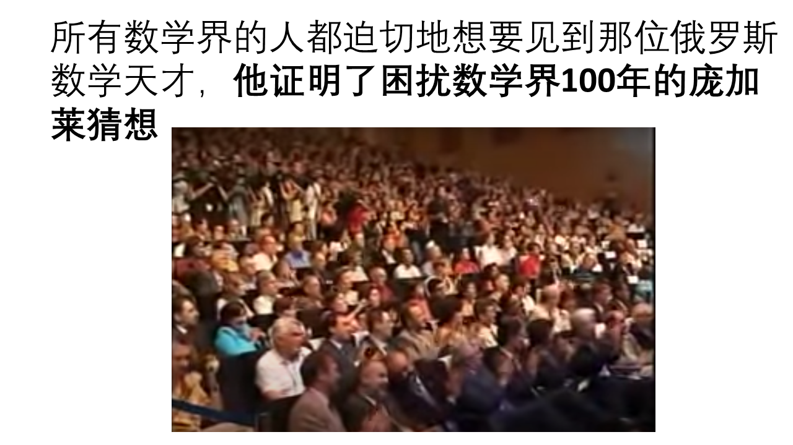
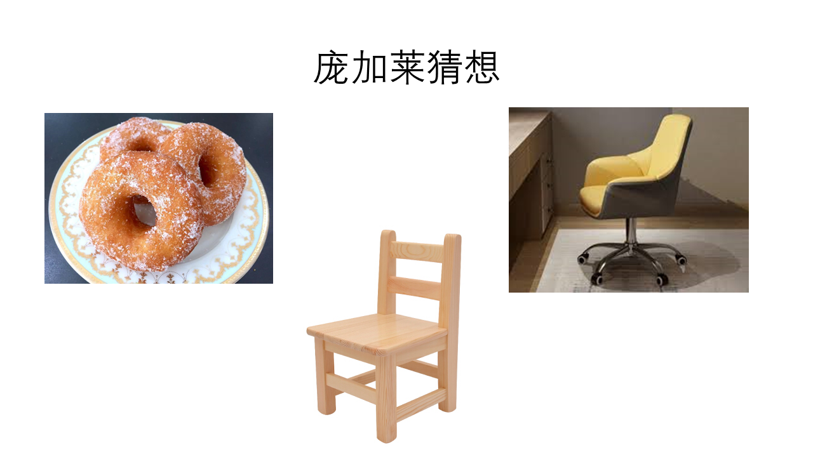

# 拒绝数学界的诺贝尔奖-菲尔茨奖和百万美元悬赏的真正数学天才-佩雷尔曼



他证明了困扰数学界100年的庞加莱猜想！ 他拒绝了数学界的诺贝尔奖-菲尔茨奖、拒绝了克雷研究所悬赏100美国的千禧年大奖、拒绝了欧洲的顶级数学大奖、
拒绝了普林斯顿大学和麻省理工学院等著名美国大学的教授职位、拒绝了俄罗斯的院士，他不屑发表论文、不屑奖励、不屑职称、不愿作假。
他说他对于学界松懈的道德规范感到非常沮丧。“不是那些违背道德标准的人被看作异类，”他说，“而是象我这样的人被孤立起来。 
他辞去了工作，隐姓埋名消失了！ 他就是佩雷尔曼!

请看YouTube视频：
[https://youtu.be/YCoJ283qP2I](https://youtu.be/YCoJ283qP2I)

### 拒绝菲尔茨奖

2006年8月22日，3000多名数学家齐聚马德里，参加第25届国际数学家大会。这次数学大会上要颁发数学界的诺贝尔奖-菲尔茨奖，费尔兹奖被认为是年轻数学家的最高荣誉，和阿贝尔奖均被称为数学界的诺贝尔奖。和以往的菲尔茨奖大会不同，对于这次大会，所有数学界的顶级数学家都迫切地想要见到一位年轻的俄罗斯数学天才，他证明了困扰数学界100年的庞加莱猜想！

[25届国际数学家大会 https://www.youtube.com/watch?v=45OirYxdArE](https://www.youtube.com/watch?v=45OirYxdArE)  2:31



### 庞加莱猜想和庞加莱

庞加莱猜想最早是由法国数学家庞加莱提出的，是美国克雷数学研究所2000年悬赏的七大千禧年大奖难题之一。

亨利·庞加莱(Henri Poincaré)，法国数学家、天体力学家、数学物理学家、科学哲学家。1854年4月29日生于法国南锡，1912年7月17日卒于巴黎。他的成就不在于他解决了多少问题，而在于他曾经提出过许多具有开创意义、奠基性的大问题。庞加莱猜想，只是其中的一个。

庞加莱也是一个天才，搞数学研究的人都知道，庞加莱是最后一个数学全才，即指其为最后一个在数学所有分支领域都造诣深厚的数学家。庞加莱之前，最后一个数学全才是高斯。庞加莱有句名言：**数学家是天生的，而不是造就的**。

一位数学史家曾经如此形容1854年出生的亨利·庞加莱（Henri Poincare）：“有些人仿佛生下来就是为了证明天才的存在似的，每次看到亨利，我就会听见这个恼人的声音在我耳边响起。”

庞加莱精通数学、天体力学、物理、哲学，对数学，数学物理，和天体力学做出了很多创造性的基础性的贡献。他提出的庞加莱猜想是数学中最著名的问题之一。在他对三体问题的研究中，庞加莱成了第一个发现混沌确定系统的人并为现代的混沌理论打下了基础。庞加莱比爱因斯坦的工作更早一步，并起草了一个狭义相对论的简略版。庞加莱群以他命名。

物理学家洛伦兹和数学家庞加莱都已经在爱因斯坦之前已经做出了相对论的大部分结果，尽管庞加莱做了相对论的许多演讲，但他一直不接受和肯定爱因斯坦的相对论。庞加莱去世时，爱因斯坦也拒绝写纪念文章，但最后爱因斯坦在1921年的讲演中公正地肯定了庞加莱对相对论的贡献。爱因斯坦评价庞加莱为相对论先驱之一，他这么说：洛伦兹已经认出了以他命名的变换对于麦克斯韦方程组的分析是基本的，而庞加莱进一步深化了这个远见。

1904年，他在原有猜想的基础上提出了“广义庞加莱猜想”，表述如下：

**每个闭n维流形，如果与n维球面Sn具有相同的同伦形，则同胚于Sn。**

对于n=3的三维流形，即：

**任一单连通的、封闭的三维流形与三维球面同胚。**

简单来说就是：每一个没有破洞的封闭三维物体，都拓扑等价于三维的球面。粗浅的比喻即为：如果我们伸缩围绕一个柳橙表面的橡皮筋，那么我们可以既不扯断它，也不让它离开表面，使它慢慢移动收缩为一个点；另一方面，如果我们想象同样的橡皮筋以适当的方向被伸缩在一个甜甜圈表面上，那么不扯断橡皮筋或者甜甜圈，是没有办法把它不离开表面而又收缩到一点的。我们说，柳橙表面是“单连通的”，而甜甜圈表面则不是。

该猜想是一个属于代数拓扑学领域的具有基本意义的命题，对“庞加莱猜想”的证明及其带来的后果将会加深数学家对流形性质的认识，甚至会对人们用数学语言描述宇宙空间产生影响，对于一维与二维的情形，此猜想是对的，现在已经知道，它对于任何维数都是对的。





### 许多数学家前赴后继，但都以失败告终

庞加莱猜想让许多数学家为之疯狂，为之抑郁、为之崩溃。耗尽了一生，以失败而告终！

20世纪30年代以前，庞加莱猜想的研究只有零星几项。但突然，英国数学家怀特海（Whitehead）对这
庞加莱猜想个问题产生了浓厚兴趣。他一度声称自己完成了证明，但不久就撤回了论文。但是失之东隅、收之桑榆，
在这个过程中，他发现了三维流形的一些有趣的特例，这些特例被称为怀特海流形。

30年代到60年代之间，又有一些著名的数学家宣称自己解决了庞加莱猜想，著名的宾（R.Bing）、哈肯（Haken）、莫伊泽（Moise）和帕帕奇拉克普罗斯（Papa-kyriakopoulos）均在其中。

帕帕奇拉克普罗斯是1964年的维布伦奖得主，一名希腊数学家。因为他的名字超长超难念，大家都称呼他“帕帕”（Papa）。在1948年以前，帕帕一直与数学圈保持一定的距离，直到被普林斯顿大学邀请做客。帕帕以证明了著名的“迪恩引理”（Dehn's Lemma）而闻名于世，喜好舞文弄墨的数学家约翰·米尔诺（John Milnor）曾经为此写下一段打油诗：
```
“无情无义的迪恩引理，
每一个拓扑学家的天敌。
直到帕帕奇拉克普罗斯，
居然证明得毫不费力。”
```
他和哈肯为破解庞加莱猜想展开了激烈的竞争，帕帕拒绝了普林斯顿大学的教授职位（即使答应他只要工作3个小时），每天早上8点半开始研究，一直到晚上。中午半个小时吃个饭。废寝忘食！当哈肯宣布证明了庞加莱猜想后，本来抑郁的帕帕仿佛生命被抽空了，幸好最后是一场虚惊。哈肯在准备提交论文时发现了错误，这次失败使哈肯换上了暴食症。他后来说换上了“庞加莱猜想综合征”。直到他转到四色问题并证明，才治愈了。

然而，帕帕这位聪明的希腊拓扑学家，却最终倒在了庞加莱猜想的证明上。在普林斯顿大学流传着一个故事。直到1976年去世前，帕帕仍在试图证明庞加莱猜想，临终之时，他把一叠厚厚的手稿交给了一位数学家朋友，然而，只是翻了几页，那位数学家就发现了错误，但为了让帕帕安静地离去，最后选择了隐忍不言。

事实上，三维庞加莱猜想在整个体系中是比较难证明的，1960年，斯梅尔（S. Smale）以及后续的数学家证明了五维和五维以上庞加莱猜想的正确性；1982年，美国数学家弗里德曼（M. Friedman）和英国数学家唐纳森（S. K. Donaldson）证明了四维庞加莱猜想；只剩下三维庞加莱猜想没有完成。


斯梅尔（Smale）在60年代初想到了一个天才的主意：如果三维的庞加莱猜想难以解决，高维的会不会容易些呢？

1960年到1961年，在里约热内卢的海滨，经常可以看到一个人，手持草稿纸和铅笔，对着大海思考。他，就是斯梅尔。

1961年的夏天，在基辅的非线性振动会议上，斯梅尔公布了自己对庞加莱猜想的五维空间和五维以上的证明，立时引起轰动。 斯梅尔由此获得1966年菲尔茨奖。

1983年，美国数学家福里德曼（Freedman）将证明又向前推动了一步。在唐纳森工作的基础上，他证出了四维空间中的庞加莱猜想，并因此获得菲尔茨奖。但是，再向前推进的工作，又停滞了。

拓扑学的方法研究三维庞加莱猜想没有进展，有人开始想到了其他的工具。瑟斯顿（Thruston）就是其中之一。他引入了几何结构的方法对三维流形进行切割，并因此获得了1983年的菲尔茨奖。

美国的数学家汉密尔顿（Richard Hamilton）提出“瑞奇流”（Ricci flow），Ricci流是以意大利数学家里奇（Gregorio Ricci）命名的一个方程。用它可以完成一系列的拓扑手术，构造几何结构，把不规则的流形变成规则的流形，从而解决三维的庞加莱猜想。Ricci流成为了解决庞加莱猜想提供了新的工具。但汉密尔顿未能走得更远，他的方法产生了“奇点”——密度无穷大的点。如何处理奇点，成为解决庞加莱猜想最关键的部分。

### 佩雷尔曼

2002年11月12日，十多位数学家收到了一封信
```
亲爱的XXX，

　　请允许我提醒您关注我在arXiv上发表的论文，该篇论文的编号是math.DG0211159。

　　摘要：本文中我们提出了一个Ricci流的单调表示，其不需要曲率假设，在所有维度中都成立。这可以被解释为某个典型集合的熵。……

　　祝万事如意！

　　格里戈里佩雷尔曼
```

如果是一般人说自己证明了，这些顶级数学家懒得理这些信件。但这次不一定，新的署名是格里戈里佩雷尔曼。1982年16随的佩雷尔曼代表苏联参加国际数学奥林匹配竞赛，以满分成绩获得金奖。他的解题速度非常快，别人用许多页，他只要几行。 1994年用3页纸就解决了过去22年无人能解决的“灵魂猜想”而一举成名！

1995年接触到“庞加莱猜想”后，佩雷尔曼淡淡地说道：“我能解决这个问题。”。然后回到了苏联的斯捷克洛夫研究所闭门研究，他每次去超市购物，买的永远都是黑面包、通心粉和酸奶。靠着留美期间积攒的几万美元，他和母亲就这么生活着。邻居很少见到他，外界也失去了他的信息，整整七年，他就像从这个世界消失一般。

他根本不稀罕在某某期刊上发表论文，只是在这个论文网上上提交了文章。但没有人看懂他的这篇不是正式发表的文章。佩雷尔曼于2003年在arXiv网站粘贴了自己的第二篇文章，在2003年4月期间，佩雷尔曼应邀去美国麻省理工做讲座

　　讲座上他向满教室的数学家展示了他的证明过程

　　但90分钟下来，似乎只有他一人真正懂得证明过程

　　但尽管这样，教室里的数学专才们仍是很认真并充满尊敬地听完了讲座
  
  
  
这时候，麻省理工学院热情地向他伸出了终身教授的橄榄枝，但佩雷尔曼感到很羞辱。他很生气自己对“庞加莱猜想”的贡献被外人当作是评判他是否具备终身教授资格的标准。　还是和之前一样，除了数学本身，没有人可以评价他。

到2003年的7月，佩雷尔曼已经在网上公布了他的后两篇文章。两年内，佩雷尔曼行云流水般在arXiv网站上粘贴了第二、三篇论文。数学家们开始艰难地阅读逐行解读他的论文，至少有3个核心团队独立进行核实，花了3年时间，然后硬是把佩雷尔曼最初的3篇论文变成了数百页的标注解析版，然后，2006年，大家表示，亲，终于可以看懂了。

但佩雷尔曼却拒绝领奖，甚至克雷数学研究所所长詹姆斯·卡尔森亲上门劝说，他也照样拒绝！

面对众多数学同行一辈子可望而不可及的至高荣誉，佩雷尔曼显得不屑一顾，他似乎不愿被世俗的喧嚣干扰他研究的净土
  
```
2010年拒绝千禧年数学100万美金
拒绝2006年的数学菲尔兹奖（不超过40岁）
2004年拒绝了俄罗斯科学院院士
2004年辞去了所有工作
1996年拒绝了欧洲数学学会给她颁发的“杰出青年数学家奖“， 颁发给32随一下的年轻数学家
1996年拒绝去斯坦福和普林斯顿大学聘请
```
此后，佩雷尔曼不再从事数学研究，并又失踪了。


一个无法理解的灵魂，不为名，不为利，只为自己喜欢的事情，他是一个传奇，也是一个神话，他就是格里戈里·佩雷尔曼。


在列宁格勒大学学习期间，佩雷尔曼和周围同学保持着良好关系，会耐心地给同学讲解如何做题。但他决不会在考试时帮助同学作弊，因为他信奉“每个人都应当自己解答自己面对的问题。”

从我们的世界观来看，他就是一个普通的不能在通的人，是一个可以被忘记，可以被忽略的人。第一没工作；第二没钱；第三没媳妇儿；第四书呆子；第五没形象；第六邋遢；第七没朋友。

他沉默寡言，彬彬有礼，而且循规蹈矩，几乎没有朋友，如果想与他交朋友，他和社会格格不入，他讨厌条条框框。他曾经有一分研究所的工作，因为研究所要求每年发表的论文数量，他认为这不是再做数学，后来辞职不干了。

  
[撬动世界的数学隐士：格里高利·佩雷尔曼](https://songshuhui.net/archives/95042)

[一个无法理解灵魂---格里戈里·佩雷尔曼](https://www.jianshu.com/p/31b8080f0af9)

[他横扫数学大奖却不屑一顾，把自己活成了数学界的谜](https://zhuanlan.zhihu.com/p/23625254)


[佩雷尔曼：看破名利的数学真隐士](https://www.douban.com/group/topic/12465290/)

[破解庞加莱猜想 俄罗斯科学家恐怖到什么程度？ ](https://k.sina.cn/article_3019808433_b3fe9eb100101raur.html)


[追寻宇宙的形状--庞加莱猜想](https://www.jianshu.com/p/fe25a4f2c201)

[一个无法理解灵魂---格里戈里·佩雷尔曼](https://www.jianshu.com/p/31b8080f0af9)

[https://www.youtube.com/watch?v=o8Hc72mo2eg ](https://www.youtube.com/watch?v=o8Hc72mo2eg )
