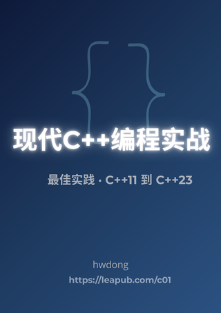

# 《现代C++编程实战》—— 从入门到应用

  

欢迎来到《现代C++编程实战》的在线预览版。本书专为零基础读者设计，直接使用 C++11/14/17/20/23 最新标准，通过简洁的示例和实战项目，带你掌握现代 C++ 的核心技术。

**预览网址**：[https://hwdong-net.github.io/mcpp](https://hwdong-net.github.io/mcpp)

## 📖 为什么选择这本书？

*   **零基础友好**：无需 C 语言基础，从第一天就用现代 C++ 开始编程。
*   **紧跟最新标准**：覆盖 C++11 至 C++23 的关键特性（`auto`、智能指针、移动语义、Lambda、`std::print`、协程等）。
*   **实战驱动**：每章配有项目案例，如学生成绩管理、猜数字游戏、Pong 游戏、字符图形库等。
*   **简洁易懂**：摒弃繁琐的历史包袱，只讲最实用的语法和最佳实践。

## 📚 内容概览

本书共 16 章，循序渐进：

1.  **基础篇**：C++ 介绍、变量与类型、运算符、语句、复合类型（数组/指针/引用）、函数。
2.  **进阶篇**：函数模板、类与对象、运算符重载、派生类、类模板。
3.  **高级篇**：异常处理、移动语义、内存管理。
4.  **标准库与元编程**：标准库（容器、算法、字符串）、模板元编程入门。

每章配有大量习题和实验，帮助巩固知识。

## 🎯 适合读者

*   编程零基础，希望系统学习现代 C++ 的学生或爱好者。
*   有 C 或旧版 C++ 经验，想升级到现代 C++ 的开发者。
*   需要一本实战导向、代码示例丰富的 C++ 参考书。

## 💡 预览版 vs 完整版

*   **预览版（当前网站）**：免费阅读每章的精简内容（约 15% 章节内容），包含核心概念、少量代码示例和购买引导。
*   **完整版（购买后）**：
    *   全部 16 章完整内容，包含所有细节讲解、大量示例、项目完整代码。
    *   每章 40+ 道习题（选择、填空、简答、编程）和多个实验。
    *   可下载 PDF/EPUB 格式，离线阅读。
    *   后续免费更新（包括 C++26 新特性）。

## 🛒 立即购买完整版

点击下方链接，支持作者持续创作，获取完整电子书：

👉 [**在 Leanpub 购买《现代C++编程实战》**](https://leanpub.com/c01)

**读者反馈**：
> “这本书直接讲现代 C++，没有 C 语言的旧包袱，示例简洁易懂，适合自学。” —— 某位已购读者

## 🔍 如何使用本预览网站

*   左侧菜单点击章节标题，即可阅读对应预览内容。
*   每章底部有购买链接，点击即可跳转 Leanpub。
*   代码块右上角可一键复制代码。

## 📧 联系与反馈

如果您发现任何错误或有改进建议，欢迎通过 Leanpub 的评论区或作者邮箱（书中提供）联系。感谢您的支持！

---

  <h3>预览网站截图</h3>
  
   
  <em>在线预览地址：<a href="https://hwdong-net.github.io/mcpp">https://hwdong-net.github.io/mcpp</a></em>

---

**开始学习**：从左侧菜单选择“第1章 C++介绍”开始您的现代 C++ 之旅吧！
